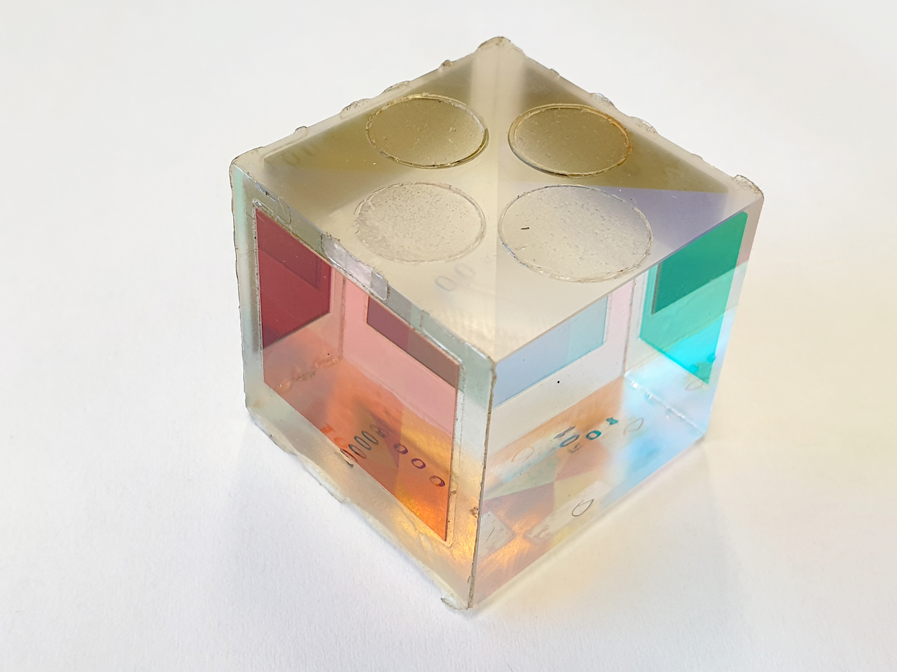
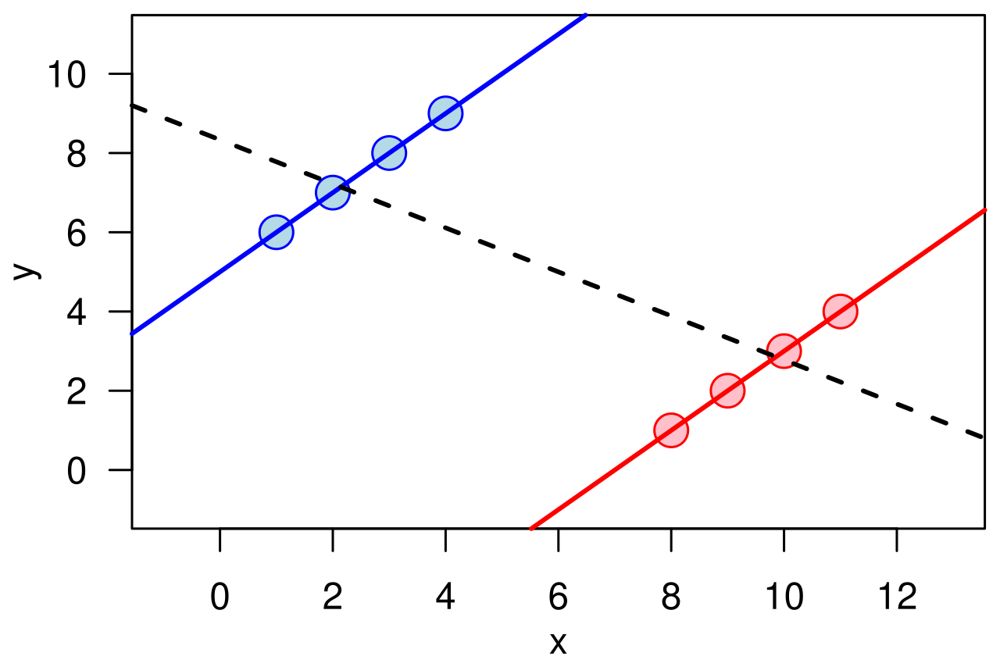
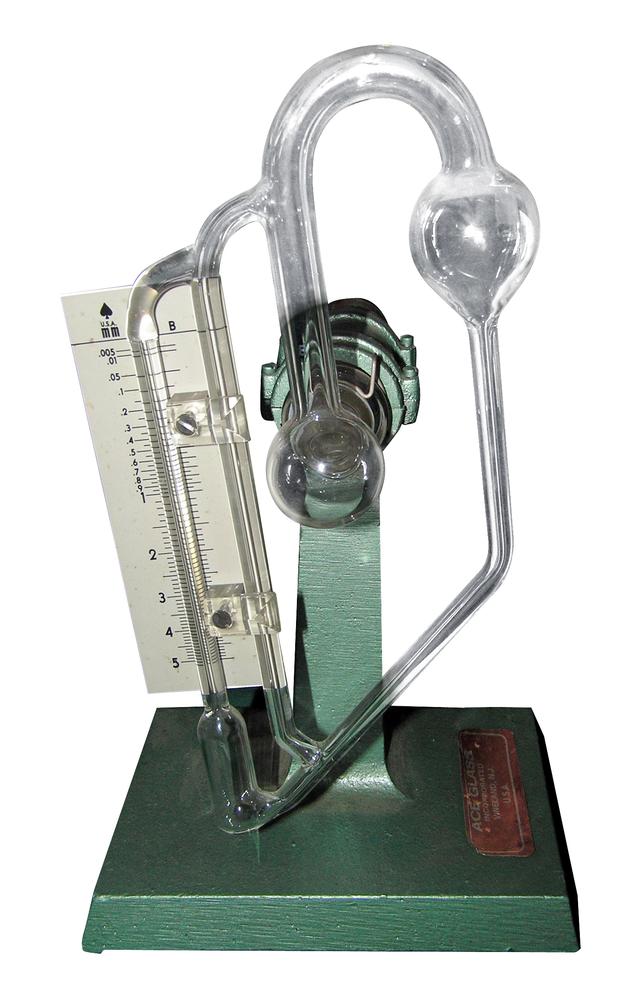

# Your Style Profile Is a Genre Artifact: Seven Fingerprints, One Trap, and a Reading Discipline

In early September 2026, our pipeline reported what looked like a clean result. In the openai library — this repository's plain label for its sample of OpenAI's public writing — the strongest institutional fingerprint appeared to be first-person voice. The median article carried 53 first-person markers, well above the pooled rest of the corpus, and the gap survived false-discovery correction, the standard safeguard against fluke findings when many tests run at once, with a p-value of 0.002 and a q-value of 0.003. By the standard we had set for ourselves, the signature was real.

One week later, we ran the same metric over the same articles and got nothing back. The comparison unit had changed: instead of pooling every article into one library-versus-library test, we compared inside shared genre cells, engineering against engineering and research against research. Within the research cell, the openai median was 55.5 markers against a same-cell pooled median of 22.0 — a raw gap larger than the one we had pooled into significance. The test returned p of 0.347 and q of 0.687; nothing survived.

The articles had not moved. The reading had.

Nor was openai a special case. Under the pooled standard — the scheme that lumps every article into one library-versus-library test — all seven English libraries in our corpus had produced a statistically significant fingerprint; under the cell-corrected standard, which compares inside shared genre cells only, zero of seven did.

What changed? Not the prose and not the counting: the genre mix inside each library had been doing quiet statistical work all along, and our pooling had read that mix as institutional voice.

## Three questions

This repository exists to read style with data: eight libraries — seven English ones sampled from public research blogs, plus the kezhongke library, this site's own Chinese corpus and the project's reference case — 164 articles, twenty-two metrics per article, each routed into one of six unified genre cells. This analysis answers three questions about what surfaced when the reading broke.

1) How large is the distortion that genre composition can inject into an institutional style claim.

2) How the two-level model corrects it, and why the correction itself deserves trust.

3) What discipline a practitioner should adopt before quoting anyone's style profile, ours included.

We will name the failure once and reuse the name throughout: genre-composition contamination, composition contamination for short. The argument runs through four sections — the headline reversal, the correction, the correction's own error history, and the validation chain — and then through the objections and the reading discipline we would hand to any reader of style data.

## The story so far

Everything reported here happened inside two September weeks, on a toolchain built for something narrower. The project began as a way to describe one library, the kezhongke corpus, and then to guide. The playbook layer turns the per-article readings into writing budgets and readability prescriptions, so a new draft is held to a measured corridor rather than to anyone's memory of the house style.

The comparison layer came from a question: whether this site's own style was an exception or one point on a field. Seven public blog streams from research organizations became the reference libraries, twenty articles each. The collection rule has not changed since: full texts stay local, and the slug lists that rebuild every sample are published with the code.

With the comparison shelf in place, the loop closed. Every article is measured, routed into a genre cell, and aggregated into the two-level budgets, and those budgets feed the playbook that new drafts are written against. Finished drafts then pass blind review and a fact audit before anything is published. Ours is the first draft in that loop whose subject is the pipeline itself.

The timing matters for reading what follows. The profiles and the first playbook were built in the early days of the month. The two-level model, the sample expansion, and the reversal at the center of this account all landed in the middle of it, within days of one another. What follows is therefore not a slow accumulation of doubts but one week in which a correction and its consequence arrived together.

We are publishing the failure because the lesson is not ours alone: anyone who quotes style data — ours, a vendor's, or a reviewer's — stands at the edge of the same trap. The trap is an old one and it has a textbook name; composition contamination is our label for its local instance, and the textbook name comes next.

## A paradox in the pooling

The textbook name for the trap is Simpson's paradox: a trend visible in a pooled table can weaken, vanish, or reverse inside every subgroup. It happens whenever the groups under comparison feed those subgroups in different proportions. Two clinics can each treat their own patients better and still post the worse pooled survival rate, if the sicker patients arrive in different shares.

The mechanism is plain aggregation: pooling weighs each stratum by group size, so groups that differ in both size and outcome will bend the pooled line. The pooled number is not lying; it is answering a different question from the one the reader asked.

Style measurement has roughly the same geometry: first-person density, paragraph length, and digit density all shift with genre, an announcement does not read like an engineering postmortem, and neither reads like an essay. When one library's sample leans on research writing while another's leans on analysis, a pooled comparison seems to measure the mix alongside the institution, and no significance test on the pooled table could tell the two apart.

The six cells in our taxonomy — analysis, engineering, research, announcement, policy, and guide — exist precisely so that this comparison can be made inside a genre before it is made across institutions. Our old standard pooled anyway: every article a library had published was lumped together and tested against the other six libraries, metric by metric. Our corpus made the trap easy to enter, because in the ten-article era seven of the ten openai articles sat in engineering or research cells, while the eleuther library contributed eight research articles and almost nothing else.

First-person voice is exactly the kind of metric that genre moves, so the pooled test appears to have credited openai with a voice that partly belonged to its reading list. What the fix looks like, and what it cost, comes next.

## 1. Seven for seven, then zero of seven: the headline reversal

The pooled standard was flattering to everyone. The old fingerprint section of our discrimination report lists all seven libraries passing false-discovery correction, with q-values at or below 0.001: cerebras on paragraph length, microsoft-research on first-person voice, and so on down the table. Seven libraries, seven signatures, seven clean certificates of distinctiveness — and, we would argue now, readings of one confound.

The corrected standard compares genre cell to genre cell: composition is treated as a lens whose curvature we can map, not a flaw to polish out. Pairwise tests run inside each cell under their own correction family, and the institutional fingerprints form a separate family of their own: library by shared cell by metric, 420 tests at the current sample size.

The split matters, because correction is priced per family: a signal that would clear a single pooled batch could fail once the test family honestly mirrors the structure of the comparison. In plain terms, each test is now judged alongside hundreds of siblings, so a lone small p-value no longer clears the bar on its own.

Under this standard the fingerprint table reads, seven times in a row: exploratory signal, did not pass correction, awaiting sample expansion. The closest approach is eleuther's low lexical diversity in the research cell, a MATTR — moving-average type-token ratio, a length-stable diversity metric — of 0.62 against a same-cell pooled 0.70. Its p-value rounds to zero; its q-value, once the family takes its share, is 0.088.

The openai library's leading signal under this standard is no longer first-person voice at all but hedge density — softeners such as "about" and "roughly" — in the research cell, 15.1 against a same-cell pooled 7.38, and it fails correction as well, at q of 0.234.

How to word a result like this is a discipline of its own, and the sample expansion put every wording to a direct test: we doubled every English library from ten to twenty articles, and the fingerprint family more than doubled with it. The conclusion did not move: zero of seven, and the nearest signal remains eleuther's, still labeled exploratory — archived, not claimed. Why the correction takes this particular shape — medians of medians — is the subject of the next section.

## 2. Medians of medians: the correction

The two-level model works like this: each article carries its twenty-two metrics, and within a library we group articles by genre cell. A cell with at least three articles yields a median, and a thinner one yields nothing, absent rather than zero. The institution value is then the median of the library's cell medians, and each cell's delta is its distance from that value. Every populated cell casts exactly one vote, so a library heavy in announcements and a library heavy in essays contribute their genres on roughly equal footing.

The correction moves real numbers, in both directions. The openai library's precise-digit density had pooled at a median of 0.92 per thousand words; the two-level institution value came out at 2.29, a correction of 149 percent upward. An engineering-heavy mix had been dragging the pooled figure down. The kezhongke library shows the mirror image: hedge density pooled at 2.39 against a two-level value of 1.42, a correction of 41 percent downward, because five verification-heavy announcement articles had been pulling the pooled figure up.

Attribution sharpened as well, in a leave-one-out exercise that assigns each article to its nearest institutional centroid. In the ten-article stage, accuracy rose from 63 percent across the pooled corpus to 75 percent inside the research cell. The exercise always runs on the cell the most libraries populate; at the current twenty-article size that is the announcement cell, and accuracy lands at 65 percent. Strip out the composition contamination and the libraries became easier to tell apart, not harder, which is roughly what a confound predicts.

The institution value is not a constant of nature; it is a function of the populated cell set. After the expansion, the openai precise-digit comparison flipped direction: the pooled median became 0.90 and the institution value 0.42, so the same comparison that had corrected upward now corrects downward, because the cell set had grown from two populated cells to five. We keep both standards on record for exactly this reason, and the repository keeps the earlier revisions as well. A correction that never changed its answer would likely be a cosmetic; ours moves with the evidence, and each move is logged.

These two numbers, the institution value and the cell delta, are what our writing playbooks actually spend. The institution value becomes the cross-genre budget for a new article, each delta becomes a per-genre adjustment, and a correction at the measurement layer flows directly into a correction at the production layer. Trusting that flow means trusting the instrument, and the instrument has its own record.

## 3. The yardstick errs too: the correction's own error history

Three repairs from the project's short history make a single point: the measurer needs measuring, and the first repair was the word lists. The Chinese hedge character for "about" sits inside the common word for "constraint", and substring matching had credited the kezhongke library with hedges it never wrote. After we switched single-character words to exact token matching, the hedge median fell from 4.75 to 2.69 per thousand characters, and about 43 percent of the old reading turned out to be pollution. Sentinel tests now guard the lists against any regression.

The second repair was length: full-text type-token ratio falls as an article grows, so eleuther's lexical density could look exceptional for partly mechanical reasons. The gap to the field, 0.204 in raw type-token ratio, shrank to 0.070 under equal-length windows — still present, roughly two-thirds smaller. We replaced the metric with a moving-window variant, MATTR at a window of 150 words, for every cross-library comparison.

The third repair was coverage. The rule-based genre router's keywords were all Chinese, so for every English article it silently fell back to a residual label; a whole layer of the pipeline had been decorative. An LLM routing pass labeled 93 articles, a second pass covered the 71 expansion articles, and a human re-adjudicated the 28 low-confidence labels, upholding all of them; the adjudication log records why each borderline article kept its label.

Every layer of this stack has shipped at least one wrong number. We have come to read that as a credential rather than a scandal: a measurement project with no correction log is likely not one that never errs but one that never checks. The remaining question is whether the corrected instrument performs.

## 4. Does the corrected lens work: the validation chain

The writing side of the pipeline has been blind-tested three times. Reviewers who did not see the drafting instructions judged generated English articles against the house style. The decisive round was judged a match by the editor; a later round, an analysis-genre article written under the two-level model, passed twelve of thirteen quantitative corridor metrics, with all six previously documented failure modes eliminated.

The corridor in question is the same one our own drafting is held to: bands for sentence and paragraph length, hedging ratios, question counts, and their siblings. The blind tests therefore measure the playbook, not the author's memory of it.

The production run added a different kind of check: a fact audit. The first full production article, an analysis of the evaluation industry, had its source pack audited line by line before release. The audit caught two errors in the pack itself: a mis-stated battle count attributed to the paper under discussion, and a regulatory timeline that a late revision had moved. Both were corrected in place and logged in the errata. A pipeline that audits its own inputs, not only its outputs, is the point of the exercise.

Underneath sits the boring part: a regression suite, forty-four tests as of mid-September 2026, that locks behavior rather than numbers, and a consistency checker that re-verifies every archive against its JSON statistics, currently eight libraries and eight passes. The corpus itself is held to the same standard: full texts stay local for copyright reasons, while the slug lists needed to re-collect every article are published, so any reader could rebuild the sample and re-run the instrument. None of this proves the style claims; it keeps the floor from moving while the claims are argued. What could still be wrong? Three objections deserve explicit verdicts.

## Three objections, three verdicts

First objection: the samples are too small, so the method proves nothing. Rebutted as stated, with a boundary left standing: the correction targets bias rather than power, removing a known confound is correct at any sample size, and the attribution gain suggests the confound was real. Where the objection does land is the fingerprint question: at twenty articles per library, no signal passes, and we do not claim otherwise. The eleuther diversity reading, q of 0.088, is registered as the tripwire — if it crosses after the next expansion, our headline changes.

Second: zero of seven means institutions have no style — rebutted. Failing false-discovery correction is not evidence of absence; it is a statement about what this sample can support. The narrower claim — institutional differences are not yet separable from genre composition at this size — is the finding, and the archived signals are the agenda for the next round.

Third: the genre labels come from an LLM, so the correction is circular — left open. The mitigations are real but partial: every low-confidence label was re-adjudicated by a human and maintained, and four cells that appear bimodal, covering fourteen articles, now carry subtype soft labels — provisional tags that promote to real cell splits only if a pre-written evidence threshold is met. But cell boundaries remain judgment calls, and the taxonomy document says so. Whether finer cells would restore any of them is something the current evidence does not cover.

With the objections priced in, a reader of anyone's style numbers still needs a working discipline.

## A reading discipline for practitioners

Five rules, each executable before lunch.

1) Stratify before you compare: behind any cross-institution style number, ask for the genre mix, and compare inside shared cells or treat the number as a description of the mix rather than of the institution.

2) Ask which standard produced the figure, and keep both standards on record: a number without one is not a measurement; it is an anecdote with decimals.

3) Treat every significant fingerprint as exploratory until it survives the right correction family: the family has to mirror the comparison structure, because one pooled batch spread over mixed genres manufactures confidence.

4) Audit the instrument before the data — word lists need substring checks, diversity metrics need length controls, routers need coverage tests, and each known failure deserves a standing sentinel test.

5) Expand with a tripwire rather than a hope: decide which archived signal, at which q-value, would change your mind, and write it down before the next batch of articles arrives.

The discount runs in both directions: a shared-cell gap that survives correction is more believable than any pooled one. A pooled gap with no cell support might be nothing but composition, to be priced that way until shown otherwise. None of these rules requires our toolchain. They require the posture that this whole project is built around: the mix is part of the measurement. What remains is the title's question, turned back on the reader.

## So is your style profile a genre artifact

So is your style profile a genre artifact? Some of it usually is, and the safe assumption is neither that the fingerprint is fake nor that it is real: an unknown share of it likely belongs to the mix, and that share is measurable.

Two questions the evidence does not cover: whether stable institutional fingerprints emerge at larger samples, and whether subtype splits redraw the cells underneath the argument; the current record answers neither.

What we can put our name on, after one reversal and three repairs:

1) Pooled cross-genre comparison reads composition as voice; in our corpus it manufactured seven significant fingerprints out of genre mix.

2) The two-level correction — cell medians first, then a median across them — is cheap, inspectable, and moved real numbers in both directions.

3) The instrument needs its own correction log; ours records three repairs that each rewrote at least one headline number.

4) The honest headline at this sample size is not fingerprints found but signals archived: zero of seven pass correction, one tripwire is registered, and the next expansion decides.

This essay was drafted under the playbook it describes; if published, it will join the corpus it analyzes, and that is as it should be. Genre composition is a lens that sits permanently in the beam of any style measurement: you do not remove it, you map its curvature and correct for the bend. We have mapped ours once, logged the correction, and left both standards on the shelf. Do the same to yours.

## Sources

- output/_group-discrimination.txt — the discrimination report: section 4b (cell-corrected fingerprint family) and section 5b (pooled standard kept for contrast).
- output/openai/STYLE-PROFILE-openai-v0.md — the openai archive's fingerprint row, carrying both standards and the research-cell first-person figures.
- output/openai/_aggregate.json and output/kezhongke/_aggregate.json — the two_level key: cell medians, institution values, and pooled naive medians, current and commit-era revisions.
- docs/genre-taxonomy-v0.md — the unified six-genre taxonomy, both LLM routing passes, the adjudication log, and the subtype soft-label scheme.
- output/kezhongke/STYLE-PROFILE-kezhongke-v0.md — the word-list pollution repair record.
- output/eleuther/STYLE-PROFILE-eleuther-v0.md — the length-pollution repair record.
- output/_p2-revalidation.md — the blind-test chain and its residual-items ledger.
- output/_production-eval-power/judge-fact.md — the production fact audit and its two logged corrections.
- profiler.py, discriminate.py, aggregate_two_level.py, check_profiles.py, tests/ — the instrument and its regression floor. Repository: github.com/SuTang-vain/style-profiler.
- Images: cover photograph by Jan Helebrant (CC0); Simpson's paradox diagram by Schutz (public domain); McLeod gauge photograph by Ytrottier and Amada44 (CC BY 2.5) — all via Wikimedia Commons.
